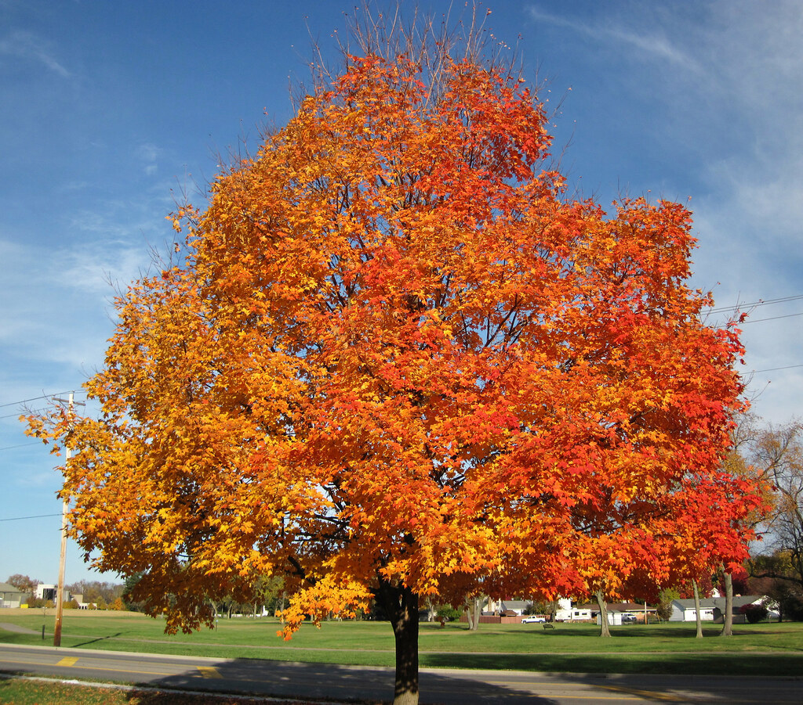

# mosaicfy

Small python script for converting any image into a mosaic made of square tiles.

## Usage

`$ python mosaicfy.py <input image path> <output image path> [options]`

Options:

* `-d <integer>` — Approximate number of tiles in each row. (default: 100)
* `-v <float>` — Random proportional variation applied to the size of each tile. (default 0.25)
* `-g <float>` — Used for detecting borders and splitting tiles to match them. Between 0 (all tiles must be splitted) and 1 (no tiles must be splitted). (default: 0.1)
* `-b <float>` — Range of the random brightness variation applied to each tile. (default: 0.75)
* `-r <int>` — Random seed. (default: 0)

## Examples

`$ python mosaicfy.py examples/tiger.jpg examples/tiger_mosaic.png`

`$ python mosaicfy.py examples/flower.jpg examples/flower_mosaic.png -d 75`

`$ python mosaicfy.py examples/parrot.jpg examples/parrot_mosaic.png`

`$ python mosaicfy.py examples/goleta.jpg examples/goleta_mosaic.png`

`$ python mosaicfy.py examples/tree.jpg examples/tree_mosaic.png`

`$ python mosaicfy.py examples/skyline.jpg examples/skyline_mosaic.png`

